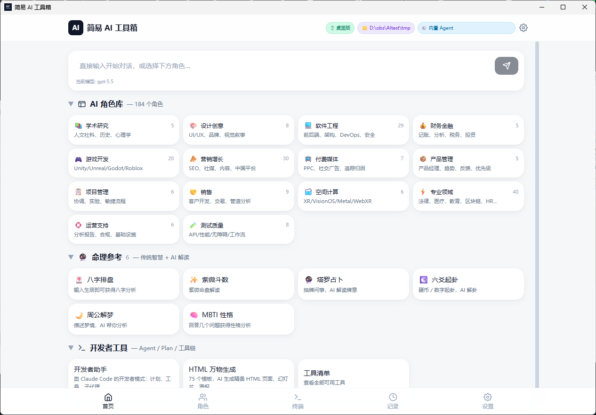
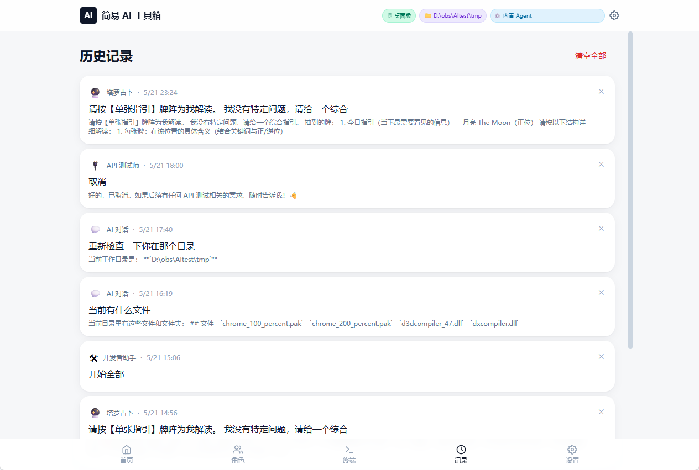
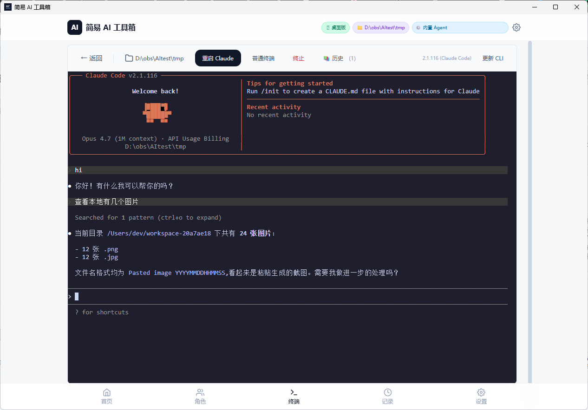
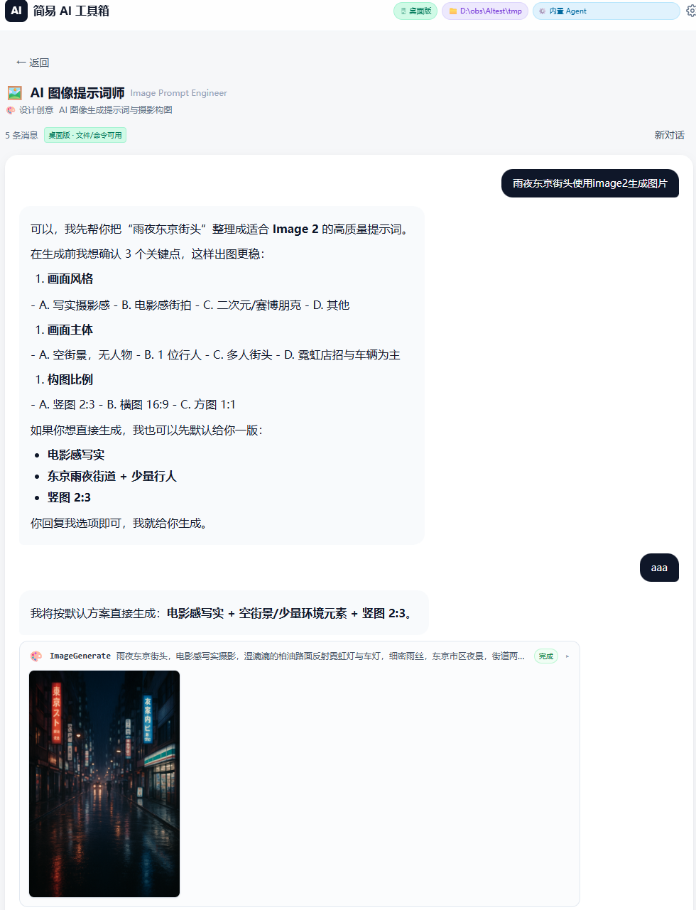
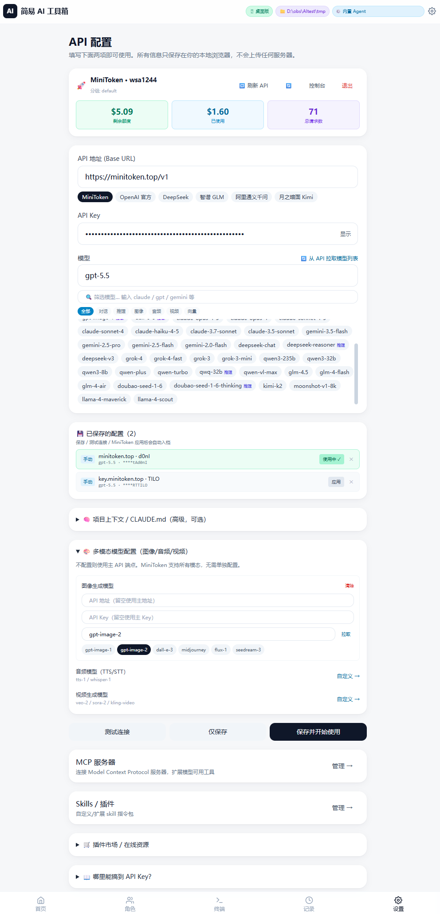

# 简易 AI 工具箱 (SimpleAI Toolbox)

一站式 AI 工具桌面应用。内置 **184 个专业 Agent 角色**、塔罗/八字/紫微等命理解读、**42 个开发者工具**（含图片/视频生成、PowerShell、配置读写、MCP 资源、工具搜索）、**75 个 HTML 模板生成器**、**Claude Code 兼容插件市场**、**Claude Code 终端**，配置一个 API Key 即可使用全部功能。

> 所有数据仅保存在本地，不上传任何服务器。



---

## 下载安装

前往 [Releases](../../releases) 页面下载最新的 **`SimpleAI-1.0.4-Setup.exe`**（约 149 MB），双击安装即可。

安装包内已封装 Claude Code CLI，首次启动会自动尝试在线更新到最新版，若网络不可用则直接使用封装版。

---

## 功能一览

### 1. AI 对话 & 184 个内置角色

支持所有 OpenAI 兼容 API，流式输出，思维链（Chain-of-Thought）展示。

**14 个角色分类，184 个专业 Agent：**

| 分类 | 数量 | 说明 |
|------|------|------|
| 💻 软件工程 | 29 | 全栈/前后端/架构/DevOps/安全 |
| ⚡ 专业领域 | 40 | 法律/医疗/教育/翻译/写作等 |
| 📣 营销增长 | 30 | SEO/内容/社媒/品牌/增长黑客 |
| 🎮 游戏开发 | 20 | Unity/Unreal/游戏设计/叙事 |
| 🤝 销售 | 9 | B2B/B2C/谈判/CRM |
| 🎨 设计创意 | 8 | UI/UX/平面/动效/品牌 |
| 🧪 测试质量 | 8 | 自动化/性能/安全测试 |
| 📺 付费媒体 | 7 | Google Ads/Meta/TikTok |
| 📋 项目管理 | 6 | 敏捷/瀑布/OKR |
| 🛟 运营支持 | 6 | 客服/SOP/知识库 |
| 🥽 空间计算 | 6 | AR/VR/3D/Vision Pro |
| 📚 学术研究 | 5 | 论文/文献/数据分析 |
| 💰 财务金融 | 5 | 财报/投资/风控 |
| 📦 产品管理 | 5 | PRD/竞品/用户研究 |

每个 Agent 均具备完整的工具调用能力（文件操作、Shell 执行、Web 搜索、子任务派遣等）。

### 2. 命理参考

| 功能 | 说明 |
|------|------|
| 八字排盘 | 输入生辰，自动排四柱八字 |
| 紫微斗数 | 命盘排列与 AI 解读 |
| 塔罗占卜 | 可视化洗牌 → 扇形展开选牌 → 翻牌动画 → AI 牌阵解读 |
| 六爻起卦 | 手动摇卦或自动起卦 |
| 周公解梦 | AI 梦境解析 |
| MBTI 性格 | 认知功能分析与兼容性评估 |

### 3. 开发者工具

**42 个内置工具：**

| 类别 | 工具 |
|------|------|
| 文件操作 | `FileRead` `FileWrite` `FileEdit` `Glob` `Grep` `NotebookEdit` |
| 命令执行 | `Bash` `PowerShell` |
| Web | `WebFetch` `WebSearch` |
| 多模态 | `ImageGenerate`（AI 图片生成）`VideoGenerate`（AI 视频生成） |
| Agent | `Agent`（子任务派遣，支持并行）`SendMessage` |
| 计划 | `EnterPlanMode` `ExitPlanMode` |
| 任务 | `TaskCreate` `TaskList` `TaskGet` `TaskUpdate` `TaskOutput` `TaskStop` |
| Todo | `TodoWrite` |
| 定时/等待 | `Sleep` `CronCreate` `CronList` `CronDelete` `ScheduleWakeup` |
| LSP | `LspStart` `LspStop` `LspDefinition` `LspReferences` `LspHover` `LspList` |
| 交互/发现 | `AskUserQuestion` `Skill` `ToolSearch` `Config` |
| MCP | `ListMcpResources` `ReadMcpResource` + 动态注册的 `mcp__*` 工具 |
| 工作树 | `EnterWorktree` `ExitWorktree` |

**6 个内置 Skill：**
- `plan-mode` — 只读研究 → 拟定计划 → 审核执行
- `web-research` — 系统化搜索 → 抓取 → 综合 → 引用来源
- `code-investigation` — Glob → Grep → FileRead 代码导航
- `bazi` / `tarot` / `mbti` — 命理专用 Skill

**9 个 Slash 命令：** `/help` `/clear` `/compact` `/plan` `/tools` `/skills` `/skill <name>` `/todos` `/tasks`

> 对话历史在 History 页统一管理，最多保留 50 条：
> 

### 4. Claude Code 终端

- 内置 Claude Code CLI（封装在安装包中，约 236 MB）
- xterm.js 全功能终端仿真（256 色、光标闪烁、自适应窗口大小）
- 支持选择工作目录、启动/重启/终止进程
- 一键在线更新 CLI 到最新版
- 未安装时自动释放封装版，也可作为普通命令行终端使用
- **v1.0.2+**：会话结束后自动保存原始 ANSI 输出到本地，📚 历史按钮打开抽屉用只读 xterm 彩色重放



### 5. MCP 服务器

连接 [Model Context Protocol](https://modelcontextprotocol.io/) 服务器，动态扩展模型可用工具。

- 支持 **HTTP/SSE** 和 **stdio** 两种传输方式
- 实时显示连接状态和可用工具数量
- 连接后工具自动注入到 Agent 工具链

### 6. 多模态智能路由

对话中自动识别用户意图，智能调用对应能力：

| 能力 | 触发方式 | 使用模型 |
|------|---------|---------|
| **图片生成** | 对话中说"画一张…" / "生成图片" | gpt-image-1/2、dall-e-3、midjourney |
| **图片修改** | 发送图片后说"修改这张图" | 同上（带 image_url） |
| **视频生成** | 说"生成视频" 或从图片继续 | veo-2/3、sora-2、kling-video |
| **语音合成** | TTS API 集成 | tts-1、tts-1-hd |
| **语音识别** | Whisper API 集成 | whisper-1 |

生成的图片/视频直接在对话中内联展示，可继续基于结果修改或生成新内容。

多模态模型端点可独立配置（不同 API 地址和 Key），也可使用 MiniToken 统一端点。**v1.0.4+**：图像/视频生成期间显示对应 SVG 占位动画；大图附件（>1MB）会显示 ⚠️ token 风险提醒。



### 7. HTML 万物生成

集成 [html-anything](https://github.com/nexu-io/html-anything) 的 **75 个精美 HTML 模板**：

| 类别 | 模板数 | 示例 |
|------|--------|------|
| 幻灯片 | 22 | 融资 Deck、技术分享、瑞士国际、赛博终端 |
| 文章 | 3 | 杂志文章、博客长文、电子指南 |
| 卡片 | 8 | 小红书、推特、Spotify、Reddit |
| 仪表板 | 8 | 看板、OKR、社媒分析、团队后台 |
| 文档 | 6 | 三栏文档、会议纪要、产品规格 |
| 原型 | 7 | SaaS 落地页、定价页、线框草图 |
| 海报/帧 | 13 | 报纸海报、像素动画、胶片漏光 |
| 其他 | 8 | 简历、发票、手机截图、营销邮件 |

输入 Markdown / CSV / JSON / 纯文本 → AI 生成精美单文件 HTML → 实时预览 → 一键下载。**v1.0.2+**：左侧大卡片侧边栏选模板（emoji + 名称 + 描述全展示）；Electron 下「💾 导出到本地」会弹原生保存框并用默认浏览器自动打开 file:// URL。


> 一份完整导出样例：[docs/screenshots/html-anything-export-example.html](docs/screenshots/html-anything-export-example.html)

### 8. 多模型支持

兼容所有 OpenAI Chat Completions 格式的 API 端点。

| 服务商 | 说明 |
|--------|------|
| **MiniToken**（默认） | 中转站，285+ 模型，国内直连，一个 Key 通用 |
| OpenAI | GPT-5.5 / GPT-4o / o3 / o4-mini / DALL-E |
| Anthropic Claude | Opus 4 / Sonnet 4 / Haiku 4.5 |
| Google Gemini | 2.5 Pro / 3.5 Flash |
| DeepSeek | DeepSeek-V3 / Reasoner |
| 智谱 GLM | GLM-4.5 系列 |
| 阿里通义千问 | Qwen3-235B / Qwen-Plus |
| 月之暗面 | Kimi-K2 |
| Grok | Grok-4 / Grok-4-Fast |
| Meta | Llama 4 Maverick / Scout |

模型列表支持从 API 实时拉取，按类型筛选（对话 / 推理 / 图像 / 音频 / 视频 / 向量）。

---

## 从源码构建

### 环境要求

- Node.js 18+
- npm 9+
- Windows 10/11 x64（Electron 打包）

### 命令

```bash
# 克隆仓库
git clone https://github.com/A0be/simple-ai.git
cd simple-ai

# 安装依赖
npm install

# Web 开发模式（浏览器访问 http://localhost:5173）
npm run dev

# Electron 桌面版开发
npm run dev                    # 终端 1：启动 Vite
npm run electron:dev           # 终端 2：启动 Electron

# 构建 Windows 安装包（输出 out/SimpleAI-x.x.x-Setup.exe）
npm run electron:build

# 构建免安装版（输出 out/win-unpacked/）
npm run electron:pack
```

构建时会自动检测系统已安装的 Claude CLI 并封装到安装包中（`scripts/bundle-claude.mjs`）。

---

## 项目结构

```
simple-ai/
├── electron/                   # Electron 主进程
│   ├── main.cjs                #   IPC、PTY 管理、Claude CLI 管理
│   └── preload.cjs             #   contextBridge 安全暴露 API
├── scripts/
│   ├── bundle-claude.mjs       #   构建时封装 Claude CLI
│   └── gen-icons.mjs           #   图标生成
├── src/
│   ├── App.tsx                 # 路由定义
│   ├── main.tsx                # 应用入口
│   ├── index.css               # Tailwind + 自定义样式
│   ├── components/
│   │   ├── ChatView.tsx        #   核心对话界面（流式输出、工具调用、附件）
│   │   ├── Layout.tsx          #   应用布局 + 底部导航
│   │   ├── TerminalPanel.tsx   #   xterm.js 终端封装
│   │   ├── ToolCallBlock.tsx   #   工具调用结果展示（含图片/视频内联渲染）
│   │   ├── MiniTokenPanel.tsx  #   MiniToken 登录/余额/Key 管理
│   │   ├── Markdown.tsx        #   纯 JS Markdown 渲染
│   │   ├── Icons.tsx           #   SVG 图标组件
│   │   └── divination/         #   命理交互组件（6 个）
│   ├── pages/
│   │   ├── Home.tsx            #   首页（快捷对话 + 功能入口）
│   │   ├── Agents.tsx          #   角色库浏览（14 分类、搜索、收藏）
│   │   ├── AgentChat.tsx       #   角色对话
│   │   ├── Feature.tsx         #   功能页（对话/写作/翻译/命理）
│   │   ├── ClaudeTerminal.tsx  #   Claude Code 终端
│   │   ├── HtmlAnything.tsx   #   HTML 万物生成（75 模板 + 预览）
│   │   ├── Settings.tsx        #   API 配置 & 模型管理
│   │   ├── History.tsx         #   对话记录
│   │   ├── Mcp.tsx             #   MCP 服务器管理
│   │   ├── Skills.tsx          #   Skill 管理
│   │   └── Tools.tsx           #   工具清单
│   └── lib/
│       ├── ai.ts               #   OpenAI 兼容 SSE 流式 API
│       ├── agentLoop.ts        #   多轮工具调用循环（并行执行只读工具）
│       ├── agents.ts           #   184 个 Agent 定义
│       ├── multimodal.ts       #   图片/视频/音频/Embedding 多模态 API
│       ├── htmlSkills.ts       #   75 个 HTML 模板元数据 + 共享设计指令
│       ├── minitoken.ts        #   MiniToken 账户/令牌/日志 API
│       ├── features.ts         #   10 个功能定义
│       ├── prompts.ts          #   系统提示词模板
│       ├── skills.ts           #   Skill 系统（内置 + 自定义）
│       ├── slash.ts            #   Slash 命令（9 个）
│       ├── storage.ts          #   localStorage 持久化
│       ├── tools/              #   工具注册 & 36 个内置工具实现
│       ├── mcp/                #   MCP 协议客户端
│       └── lsp/                #   LSP 语言服务客户端
├── public/icons/               # 应用图标
├── package.json                # 依赖 + electron-builder 配置
├── vite.config.ts              # Vite 构建配置
├── tailwind.config.js          # Tailwind 主题
└── tsconfig.json               # TypeScript 配置
```

---

## 技术栈

| 层 | 技术 |
|----|------|
| UI 框架 | React 18 + TypeScript 5 |
| 构建工具 | Vite 5 |
| 样式 | Tailwind CSS 3 |
| 桌面运行时 | Electron 42 |
| 终端仿真 | xterm.js 6 + node-pty 1.x |
| 桌面打包 | electron-builder (NSIS) |
| PWA | vite-plugin-pwa |
| API 协议 | OpenAI Chat Completions (SSE) |
| 工具协议 | MCP (JSON-RPC 2.0) |
| 存储 | localStorage（配置、对话、收藏、MCP 服务器） |

零外部 UI 组件依赖 — Markdown 渲染器、图标组件均为项目内实现。

---

## 配置说明

### 基础配置

1. 打开应用 → 设置
2. 选择 API 服务商（默认 MiniToken）
3. 填写 API Key
4. 选择或输入模型名称
5. 点击「测试连接」验证

**v1.0.2+ 新增**：保存 / 测试 / MiniToken 应用后会自动入档；每条档案可独立配置 SOCKS5 代理（支持 `user:pass@host:port` 认证），切档自动应用。



### API Key 获取

| 服务商 | 说明 | 地址 |
|--------|------|------|
| **MiniToken**（推荐） | 一个 Key 调用 285+ 模型，国内直连 | [minitoken.top](https://minitoken.top) |
| **DeepSeek** | 国内可用，新用户送额度 | [platform.deepseek.com](https://platform.deepseek.com) |
| **智谱 GLM** | 国内可用，有免费额度 | [open.bigmodel.cn](https://open.bigmodel.cn) |
| **OpenAI** | 最新模型，需国际网络 | [platform.openai.com](https://platform.openai.com) |

### 多模态模型

设置页可单独配置图像生成（gpt-image-1 / DALL-E 3）、语音（TTS / Whisper）、视频（Veo / Sora）模型的端点和 Key。不配置则使用主 API。

---

## 运行环境对比

| 模式 | 本地工具 | 终端 | 启动方式 |
|------|---------|------|---------|
| **Electron 桌面版** | 全部可用 | 可用 | `npm run electron:dev` |
| **Tauri 桌面版** | 全部可用 | — | `npm run tauri:dev` |
| **Web + Companion** | 全部可用 | — | `npm run dev` + companion |
| **纯 Web / PWA** | 仅在线工具 | — | `npm run dev` |

---

## 许可证

MIT — 自由使用、修改、分发。

命理功能仅供娱乐参考，不构成任何专业建议。

---

## 文档与变更

- 🏛️ **架构文档**：[ARCHITECTURE.md](docs/ARCHITECTURE.md) — 模块划分、数据流、依赖矩阵、扩展点
- 📊 **功能状态表**：[FEATURE_STATUS.md](docs/FEATURE_STATUS.md) — 每个功能的版本/状态/限制
- 🗺️ **后期路线图**：[ROADMAP.md](docs/ROADMAP.md) — v1.1+ 计划与技术债
- 🔧 **工具参考**：[TOOLS.md](docs/TOOLS.md) — 42 个工具的用途、参数、示例
- 📜 **变更日志**：[CHANGELOG.md](docs/CHANGELOG.md) — 每个版本的完整改动列表
- 🆚 **工具对照**：[TOOLS_COMPARISON.md](docs/TOOLS_COMPARISON.md) — simple-ai vs Anthropic Claude Code
- 📸 **截图目录**：[docs/screenshots/](docs/screenshots/)
